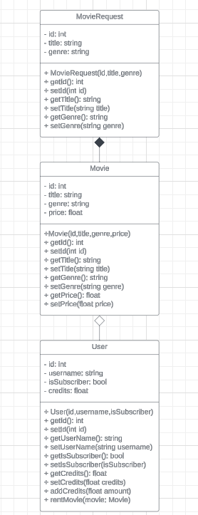

# Patika OOP (Object Oriented Programming) Dersi Online Film Sistemi UML Diyagram Projesi

Online Film Sistemi UML Diyagram Projesi

[Proje Diyagramına Git](https://lucid.app/lucidchart/b6026f32-4b34-43cf-ade1-7fffe3edca08/edit?viewport_loc=479%2C-78%2C4030%2C1596%2C0_0&invitationId=inv_a7cd236e-3304-483f-a9ce-4ac6629f98a2)

Proje Diyagramı Görselleri

